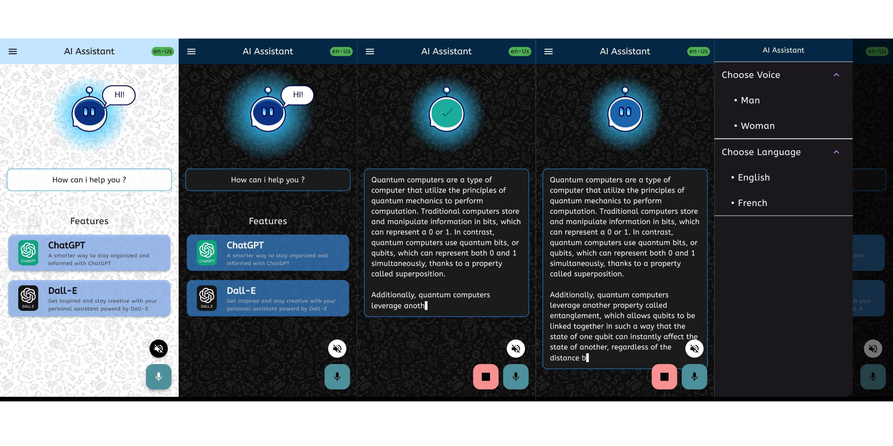

# OpenAI Voice Assistant 🤖

## Description

Welcome to **OpenAI Voice Assistant** – a versatile Flutter application that harnesses the power of OpenAI API to provide a seamless experience for users. Whether you want to generate text using GPT or create images using DALL-E, this app has got you covered. With a user-friendly voice input system and a text-to-speech assistant, **[Your App Name]** is designed to make interactions effortless and enjoyable.

## Features

- **Voice Input:** Easily ask questions and make requests using the built-in voice input system.
  
- **GPT Text Generation:** Leverage OpenAI's GPT for generating informative and creative text responses to user queries.

- **DALL-E Image Generation:** Create visually stunning images using OpenAI's DALL-E.

- **Text-to-Speech Assistant:** Get assistance with the generated text through a convenient text-to-speech feature.

- **Dark and Light Themes:** Customize your app experience with both dark and light theme options.

## Screenshots

